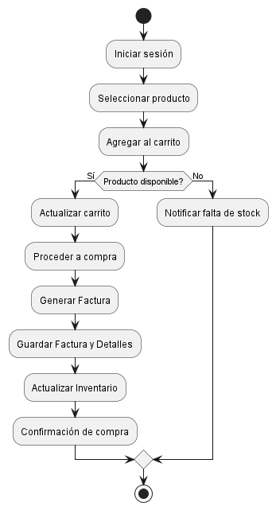

## **SISTEMA DE CARRITO DE COMPRAS** ##
 ------------------------------------------
 ### **Integrante** ###
 - Maria Sofia Aljure Herrera
 ------------------------------------------
 ### **Descripción General** ###
 - Para este proyecto, se desarrollara una base de datos para un sistema de carrito de compras que integre
 funcionalidades tanto para administradores como para compradores.
 -----------------------------------------
 ### **Diagrama De Actividad** ###
Modela el flujo de trabajo o de procesos, describiendo actividades secuenciales y paralelas, en este caso modela el flujo de acciones del sistema de carrito de compras, desde el inicio de sesión del usuario hasta la confirmación de la compra o la notificación de falta de stock.
## **Estructura Base De Datos** ##
1. - **start y stop** start marca el punto de inicio del flujo de actividades, y stop el punto final.
2. **Acciones**
- **sesión;** Representa la primera actividad en la que el usuario inicia sesión en el sistema.
- **producto;** El usuario elige el producto que quiere comprar.
- **al carrito;** Una vez seleccionado el producto, el usuario lo agrega al carrito de compras.
3. **Condición (if statement)**
- **if (Producto disponible?) then (Sí)** Verifica si el producto está disponible en el inventario.
Si **Sí**, se ejecutan las siguientes actividades:
- **carrito;** El sistema actualiza el carrito con el nuevo producto.
- **a compra;** El usuario procede a la compra.
- **Factura;** El sistema genera una factura para la compra.
- **Factura y Detalles;** La factura y sus detalles se almacenan en la base de datos.
- **Inventario;** El inventario se actualiza para reflejar la compra del producto.
- **ón de compra;** Se envía una confirmación de compra al usuario.
Si **No**, es decir, el producto no está disponible:
- **falta de stock;** El sistema notifica al usuario sobre la falta de stock.
4. Finalización:
- Tras completar cualquiera de los flujos (compra exitosa o notificación de falta de stock), se llega al nodo stop, finalizando el proceso.
- ## **En ese orden de ideas esta seria la explicación textual del diagrama** ##
El usuario inicia sesión, selecciona un producto y lo agrega al carrito, el sistema verificara si el producto está disponible y
Si está disponible, el flujo continúa con la actualización del carrito y generara la factura almacenando los detalles y actualizando el inventario y si no está disponible, el flujo termina con una notificación de falta de stock.

-----------------------------------------
## **DIAGRAMA DE ACTIVIDAD (FORMATO WSD)** ##
```js
@startuml Diagrama De Actividad

start
:Iniciar sesión;
:Seleccionar producto;
:Agregar al carrito;
if (Producto disponible?) then (Sí)
  :Actualizar carrito;
  :Proceder a compra;
  :Generar Factura;
  :Guardar Factura y Detalles;
  :Actualizar Inventario;
  :Confirmación de compra;
else (No)
  :Notificar falta de stock;
endif
stop
@enduml
```
--------------------------------------------

