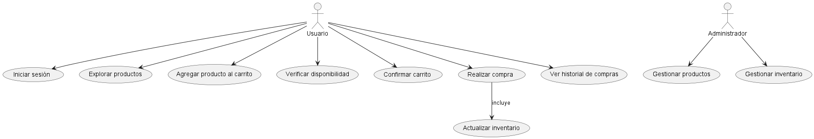

## **SISTEMA DE CARRITO DE COMPRAS** ##
 ------------------------------------------
 ### **Integrante** ###
 - Maria Sofia Aljure Herrera
 ------------------------------------------
 ### **Descripción General** ###
 - Para este proyecto, se desarrollara una base de datos para un sistema de carrito de compras que integre
 funcionalidades tanto para administradores como para compradores.
 -----------------------------------------
 ### **Diagrama De Casos De Uso** ###
Modela las funcionalidades del sistema desde la perspectiva del usuario y su interacción con los actores.
## **Estructura Base De Datos** ##
### **Explicación textual del diagrada** ###
El usuario Interactúa principalmente con los casos de uso relacionados con el flujo de compra, desde la autenticación hasta la confirmación de la compra. Después de realizar la compra, puede ver su historial, el administrador tiene casos de uso adicionales para gestionar los productos y el inventario, son acciones que no están disponibles para el usuario regular y la relación de Inclusión es la actualización del inventario que es parte del caso de uso Realizar compra, porque siempre que se complete una compra, el sistema necesita ajustar el stock del inventario.

------------------------------------------
## **DIAGRAMA DE CASOS DE USOS (FORMATO WSD)** ##
```js
@startuml Diagrama De Caso De Uso

actor Usuario
actor Administrador

Usuario --> (Iniciar sesión)
Usuario --> (Explorar productos)
Usuario --> (Agregar producto al carrito)
Usuario --> (Verificar disponibilidad)
Usuario --> (Confirmar carrito)
Usuario --> (Realizar compra)

(Realizar compra) --> (Actualizar inventario) : incluye
Usuario --> (Ver historial de compras)

Administrador --> (Gestionar productos)
Administrador --> (Gestionar inventario)

@enduml

```
------------------------------------
