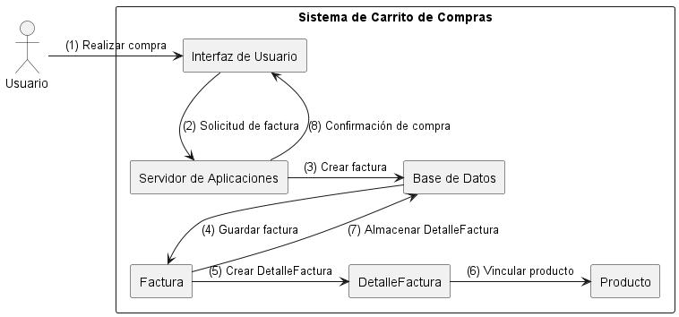

## **SISTEMA DE CARRITO DE COMPRAS** ##
 ------------------------------------------
 ### **Integrante** ###
 - Maria Sofia Aljure Herrera
 ------------------------------------------
 ### **Descripción General** ###
 - Para este proyecto, se desarrollara una base de datos para un sistema de carrito de compras que integre
 funcionalidades tanto para administradores como para compradores.
 -----------------------------------------
 ### **Diagrama De Colaboración** ###
 muestra las interacciones entre objetos destacando las relaciones y mensajes intercambiados.
## **Estructura Base De Datos** ##
- **@startuml y @enduml** Estas son las etiquetas que inician y terminan el diagrama en PlantUML.
- **skinparam actorPadding y rectanglePadding** Estas líneas son las que configuran el espacio de padding para el actor (actorPadding) y para los rectángulos (rectanglePadding) que representan los componentes.
- **actor Usuario** Se define el actor "Usuario" en el sistema, que es quien inicia la compra.
- **rectangle "Sistema de Carrito de Compras"** Es el que crea un contenedor para todos los elementos del sistema relacionados con el carrito de compras. (Todo lo que está dentro de este contenedor pertenece al sistema de carrito de compras).
## **Componentes en el Sistema de Carrito de Compras** ##
- **rectangle "Interfaz de Usuario" as UI** Es el que crea el componente Interfaz de Usuario, representado como UI. Esta interfaz es el punto de interacción entre el Usuario y el sistema.
- **rectangle "Servidor de Aplicaciones" as Servidor** Es el que crea el componente Servidor de Aplicaciones, etiquetado como Servidor. 
- **rectangle "Base de Datos" as BD** Este es el que crea el componente Base de Datos, etiquetado como BD. Es donde se almacenan los datos del sistema.
- **rectangle Factura, rectangle DetalleFactura, y rectangle Producto** Es el que crea los componentes Factura, DetalleFactura, y Producto, que representan las distintas entidades que participan en la compra.
## **Flujo de Interacción** ##
- **Usuario -> UI : (1) Realizar compra** El Usuario inicia el proceso de compra enviando una solicitud a la Interfaz de Usuario.
- **UI -> Servidor : (2) Solicitud de factura** La Interfaz de Usuario envía una solicitud al Servidor de Aplicaciones para generar una factura.
- **Servidor -> BD : (3) Crear factura** El Servidor de Aplicaciones solicita a la Base de Datos crear una nueva factura.
- **BD --> Factura : (4) Guardar factura** Aca la Base de Datos guarda la factura en el sistema.
- **Factura -> DetalleFactura : (5) Crear DetalleFactura** La Factura genera un DetalleFactura para cada producto en el carrito de compras.
- **DetalleFactura -> Producto : (6) Vincular producto** El DetalleFactura se asocia con el Producto correspondiente.
- **Factura -> BD : (7) Almacenar DetalleFactura** Aquí la Factura guarda el DetalleFactura en la Base de Datos.
- **Servidor --> UI : (8) Confirmación de compra** Es el Servidor de Aplicaciones que envía una confirmación de la compra a la Interfaz de Usuario, que a su vez muestra esta confirmación al Usuario.

- ## **En ese orden de ideas esta seria la explicación textual del diagrama** ##
El usuario inicia la compra, el actor Usuario comienza el proceso enviando una solicitud de compra a la Interfaz de Usuario y la Interfaz de Usuario envía una solicitud de factura al Servidor de Aplicaciones así mismo el Servidor de Aplicaciones solicita a la Base de Datos crear una nueva factura, la Base de Datos guarda la factura en el sistema y la Factura crea un DetalleFactura para cada producto en la compra, el DetalleFactura se asocia con el Producto correspondiente en el sistema y la Factura almacena el DetalleFactura en la Base de Datos y así mismo el Servidor de Aplicaciones envía una confirmación de compra a la Interfaz de Usuario, que a su vez informa al Usuario.

---------------------------------------
## **DIAGRAMA DE COLABORACIÓN (FORMATO WSD)** ##
```js
@startuml Diagrama De Colaboración
skinparam actorPadding 10
skinparam rectanglePadding 10

actor Usuario
rectangle "Sistema de Carrito de Compras" {
rectangle "Interfaz de Usuario" as UI
rectangle "Servidor de Aplicaciones" as Servidor
rectangle "Base de Datos" as BD
rectangle Factura
rectangle DetalleFactura
rectangle Producto

Usuario -> UI : (1) Realizar compra
UI -> Servidor : (2) Solicitud de factura
Servidor -> BD : (3) Crear factura
BD --> Factura : (4) Guardar factura
Factura -> DetalleFactura : (5) Crear DetalleFactura
DetalleFactura -> Producto : (6) Vincular producto
Factura -> BD : (7) Almacenar DetalleFactura
Servidor --> UI : (8) Confirmación de compra
}
@enduml

```
------------------------------------------
