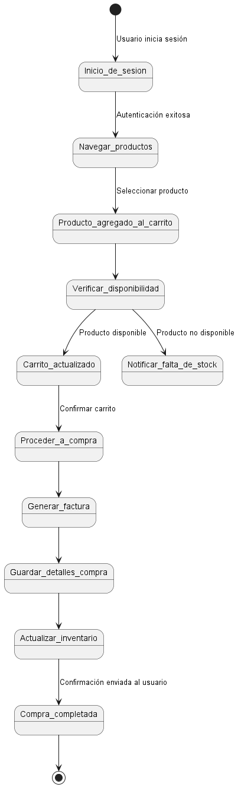

 ## **SISTEMA DE CARRITO DE COMPRAS** ##
 ------------------------------------------
 ### **Integrante** ###
 - Maria Sofia Aljure Herrera
 ------------------------------------------
 ### **Descripción General** ###
 - Para este proyecto, se desarrollara una base de datos para un sistema de carrito de compras que integre
 funcionalidades tanto para administradores como para compradores.
 -----------------------------------------
 ### **Diagrama De Estados** ###
Representa los estados de un objeto y las transiciones entre estos en respuesta a eventos.
### **Estructura** ###
1. **Inicio del diagrama**
[*] --> Inicio_de_sesion : Usuario inicia sesión
[ * ] representa el estado inicial del sistema.
- La flecha indica una transición hacia el estado Inicio_de_sesion, etiquetada con el evento Usuario inicia sesión.
2. **Transición a Navegar productos**
Inicio_de_sesion --> Navegar_productos : Autenticación exitosa
- Este paso representa una transición desde Inicio_de_sesion al estado Navegar_productos.
- La etiqueta Autenticación exitosa indica que la transición ocurre cuando el usuario ha iniciado sesión con éxito.
3. **Seleccionar y agregar productos al carrito**
Navegar_productos --> Producto_agregado_al_carrito : Seleccionar producto
Producto_agregado_al_carrito --> Verificar_disponibilidad
- Navegar_productos indica que el usuario está explorando productos.
- Cuando el usuario selecciona un producto, se produce una transición hacia Producto_agregado_al_carrito.
- Luego, automáticamente se pasa al estado Verificar_disponibilidad, donde se comprueba si el producto está en stock.
4. **Verificar disponibilidad del producto**
Verificar_disponibilidad --> Carrito_actualizado : Producto disponible
Verificar_disponibilidad --> Notificar_falta_de_stock : Producto no disponible
- Este bloque maneja dos escenarios posibles **-->**
- Si el producto está disponible, se realiza la transición al estado Carrito_actualizado.
- Si el producto no está disponible, se realiza la transición a Notificar_falta_de_stock, notificando al usuario que el producto no tiene stock.
5. **Proceder a la compra y generar la factura**
Carrito_actualizado --> Proceder_a_compra : Confirmar carrito
Proceder_a_compra --> Generar_factura
- Carrito_actualizado representa el estado donde el carrito ha sido actualizado exitosamente.
- El usuario confirma el carrito, generando una transición hacia Proceder_a_compra.
- Luego se pasa a Generar_factura, donde se crea una factura para la compra.
6. **Guardar detalles y actualizar inventario**
Generar_factura --> Guardar_detalles_compra
Guardar_detalles_compra --> Actualizar_inventario
- Guardar_detalles_compra indica el estado donde la factura y los detalles de la compra se almacenan en la base de datos.
- Luego se transita a Actualizar_inventario, donde se reduce el stock de los productos comprados en el inventario.
7. **Compra completada**
Actualizar_inventario --> Compra_completada : Confirmación enviada al usuario
Compra_completada --> [*]
- Compra_completada representa el estado final del proceso de compra.
- La transición [*] indica el fin del flujo del proceso de compra.
-------------------------------------------
 ## **DIAGRAMA DE ESTADOS (FORMATO WSD)** ##
```js
@startuml Diagrama De Estado-Transición

[*] --> Inicio_de_sesion : Usuario inicia sesión

Inicio_de_sesion --> Navegar_productos : Autenticación exitosa
Navegar_productos --> Producto_agregado_al_carrito : Seleccionar producto
Producto_agregado_al_carrito --> Verificar_disponibilidad

Verificar_disponibilidad --> Carrito_actualizado : Producto disponible
Verificar_disponibilidad --> Notificar_falta_de_stock : Producto no disponible

Carrito_actualizado --> Proceder_a_compra : Confirmar carrito
Proceder_a_compra --> Generar_factura
Generar_factura --> Guardar_detalles_compra
Guardar_detalles_compra --> Actualizar_inventario
Actualizar_inventario --> Compra_completada : Confirmación enviada al usuario

Compra_completada --> [*]

@enduml

```
-----------------------------------------
