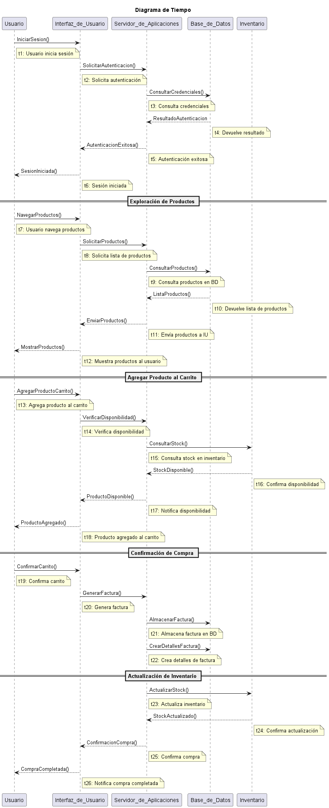

## **SISTEMA DE CARRITO DE COMPRAS** ##
 ------------------------------------------
 ### **Integrante** ###
 - Maria Sofia Aljure Herrera
 ------------------------------------------
 ### **Descripción General** ###
 - Para este proyecto, se desarrollara una base de datos para un sistema de carrito de compras que integre
 funcionalidades tanto para administradores como para compradores.
 -----------------------------------------
 ### **Diagrama De Tiempo** ###
Representa el cambio de estado de los objetos o eventos a lo largo del tiempo, en este caso el diagrama representara cómo los objetos del sistema cambian de estado y responden a los eventos generados durante el proceso de compra, secuenciados en el tiempo.
## **Estructura Base De Datos** ##
### **Explicación Textual** ###
En Inicio de Sesión el usuario inicia sesión, el sistema verifica las credenciales en la base de datos y confirma la autenticación y en
exploración de Productos el usuario navega por los productos disponibles, que se recuperan de la base de datos y se muestran en la interfaz de usuario, al agregar Producto al Carrito el sistema verifica la disponibilidad en el inventario y la confirmación de Compra,el usuario confirma el carrito, y el sistema genera una factura y la guarda junto con los detalles de la compra en la base de datos,
y en la actualización de Inventario Finalmente, el inventario se actualiza para reflejar la reducción en el stock después de la compra,y el sistema notificara la confirmación de la compra al usuario.
## **DIAGRAMA DE TIEMPO (FORMATO WSD)** ##
```js
@startuml Tiempo
title Diagrama de Tiempo 

participant Usuario
participant Interfaz_de_Usuario as IU
participant Servidor_de_Aplicaciones as SA
participant Base_de_Datos as BD
participant Inventario as INV

Usuario -> IU : IniciarSesion()
note right of Usuario : t1: Usuario inicia sesión
IU -> SA : SolicitarAutenticacion()
note right of IU : t2: Solicita autenticación
SA -> BD : ConsultarCredenciales()
note right of SA : t3: Consulta credenciales
BD --> SA : ResultadoAutenticacion
note right of BD : t4: Devuelve resultado
SA --> IU : AutenticacionExitosa()
note right of SA : t5: Autenticación exitosa
IU --> Usuario : SesionIniciada()
note right of IU : t6: Sesión iniciada

== Exploración de Productos ==
Usuario -> IU : NavegarProductos()
note right of Usuario : t7: Usuario navega productos
IU -> SA : SolicitarProductos()
note right of IU : t8: Solicita lista de productos
SA -> BD : ConsultarProductos()
note right of SA : t9: Consulta productos en BD
BD --> SA : ListaProductos()
note right of BD : t10: Devuelve lista de productos
SA --> IU : EnviarProductos()
note right of SA : t11: Envía productos a IU
IU --> Usuario : MostrarProductos()
note right of IU : t12: Muestra productos al usuario

== Agregar Producto al Carrito ==
Usuario -> IU : AgregarProductoCarrito()
note right of Usuario : t13: Agrega producto al carrito
IU -> SA : VerificarDisponibilidad()
note right of IU : t14: Verifica disponibilidad
SA -> INV : ConsultarStock()
note right of SA : t15: Consulta stock en inventario
INV --> SA : StockDisponible()
note right of INV : t16: Confirma disponibilidad
SA --> IU : ProductoDisponible()
note right of SA : t17: Notifica disponibilidad
IU --> Usuario : ProductoAgregado()
note right of IU : t18: Producto agregado al carrito

== Confirmación de Compra ==
Usuario -> IU : ConfirmarCarrito()
note right of Usuario : t19: Confirma carrito
IU -> SA : GenerarFactura()
note right of IU : t20: Genera factura
SA -> BD : AlmacenarFactura()
note right of SA : t21: Almacena factura en BD
SA -> BD : CrearDetallesFactura()
note right of SA : t22: Crea detalles de factura

== Actualización de Inventario ==
SA -> INV : ActualizarStock()
note right of SA : t23: Actualiza inventario
INV --> SA : StockActualizado()
note right of INV : t24: Confirma actualización
SA --> IU : ConfirmacionCompra()
note right of SA : t25: Confirma compra
IU --> Usuario : CompraCompletada()
note right of IU : t26: Notifica compra completada

@enduml
```
--------------------------------------------
