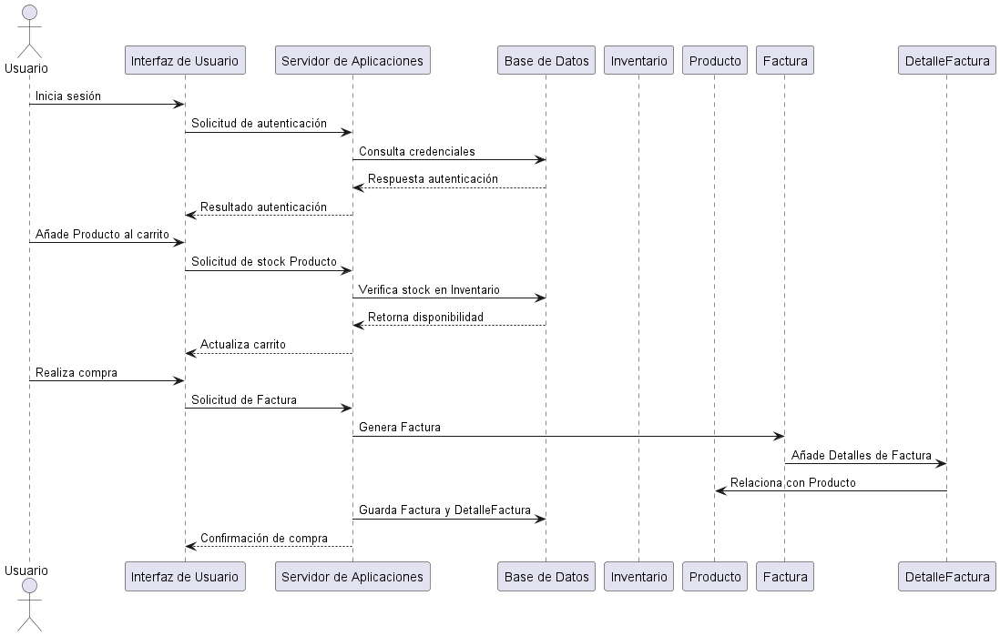

 ## **SISTEMA DE CARRITO DE COMPRAS** ##
 ------------------------------------------
 ### **Integrante** ###
 - Maria Sofia Aljure Herrera
 ------------------------------------------
 ### **Descripción General** ###
 - Para este proyecto, se desarrollara una base de datos para un sistema de carrito de compras que integre
 funcionalidades tanto para administradores como para compradores.
 -----------------------------------------
 ### **Diagrama De Secuencia** ###
 Es el que describe las interacciones entre objetos en un orden cronológico, en este caso este diagrama de secuencia es el que muestra el flujo de interacción entre el usuario, la interfaz, el servidor, la base de datos, el inventario, el producto, la factura y el detalle de la factura para el proceso de autenticación y compra en el sistema de carrito de compras.
## **Estructura Base De Datos** ##
1. #### **Autenticación del Usuario**
- **Usuario -> UI: Inicia sesión** En esta linea el usuario inicia sesión desde la interfaz de usuario (UI)(User Interface, guia al usuario por la aplicación durante el tiempo que él la usa)
- **UI -> Servidor: Solicitud de autenticación** UI envía una solicitud de autenticación al servidor de aplicaciones.
- **Servidor -> BD: Consulta credenciales** Aca servidor consulta las credenciales en la base de datos para verificar la autenticación.
- **BD --> Servidor: Respuesta autenticación** Y aca base de datos responde con el resultado de la autenticación (éxito o fallo).
- **Servidor --> UI: Resultado autenticación** El servidor devuelve el resultado a la UI, permitiendo al usuario proceder si es autenticado correctamente.
2. #### **Selección de Productos** ####
- **Usuario -> UI** Aca se añade Producto al carrito y el usuario selecciona ese producto para añadirlo al carrito.
- **UI -> Servidor** Se solicita el stock del poroducto y La UI envía una solicitud al servidor para verificar la disponibilidad del producto seleccionado.
- **Servidor -> BD** Se verifica el stock en Inventario y el servidor consulta la base de datos para verificar el stock en el inventario.
- **BD --> Servidor** Se retorna la disponibilidad y la base de datos devuelve la disponibilidad del producto.
- **Servidor --> UI** Se actualiza el carrito y La UI se actualiza con la información de disponibilidad y añade el producto al carrito si hay suficiente stock.
3. #### **Proceso de Compra** ####
- **Usuario -> UI** Se realiza la compra y el usuario confirma la compra desde la UI.
- **UI -> Servidor** Se solicitud la Factura y la UI envía una solicitud de factura al servidor para registrar la compra.
- **Servidor -> Factura** Se genera la factura y el servidor inicia la generación de la factura.
- **Factura -> DetalleFactura** Se añade los detalles de Factura y la factura genera un detalle de factura con los productos incluidos en la compra.
- **DetalleFactura -> Producto** Se relaciona con producto y Cada detalle de la factura se vincula al producto correspondiente.
- **Servidor -> BD** Se guarda Factura y DetalleFactura y el servidor almacena la factura y los detalles de la factura en la base de datos.
- **Servidor --> UI** Se confirma la compra y finalmente, el servidor envía una confirmación de compra a la UI, que muestra al usuario el éxito de la transacción.
----------------------------------
## **Estructura del Diagrama ##
- **Actor (Usuario)** Es el que representa a la persona que interactúa con el sistema.
- **Participantes** (UI, Servidor, BD, Inventario, Producto, Factura, DetalleFactura) Representan los componentes del sistema que colaboran para realizar las operaciones de autenticación, actualización del carrito y generación de la factura.
- **Mensajes (→)** Son los que muestran el intercambio de datos o solicitudes entre los actores y participantes.
----------------------------------
## **DIAGRAMA DE SECUENCIA (FORMATO WSD)** ##
```js
@startuml Diagrama De Secuencia 
actor Usuario
participant "Interfaz de Usuario" as UI
participant "Servidor de Aplicaciones" as Servidor
participant "Base de Datos" as BD
participant Inventario
participant Producto
participant Factura
participant DetalleFactura

Usuario -> UI: Inicia sesión
UI -> Servidor: Solicitud de autenticación
Servidor -> BD: Consulta credenciales
BD --> Servidor: Respuesta autenticación
Servidor --> UI: Resultado autenticación

Usuario -> UI: Añade Producto al carrito
UI -> Servidor: Solicitud de stock Producto
Servidor -> BD: Verifica stock en Inventario
BD --> Servidor: Retorna disponibilidad
Servidor --> UI: Actualiza carrito

Usuario -> UI: Realiza compra
UI -> Servidor: Solicitud de Factura
Servidor -> Factura: Genera Factura
Factura -> DetalleFactura: Añade Detalles de Factura
DetalleFactura -> Producto: Relaciona con Producto
Servidor -> BD: Guarda Factura y DetalleFactura
Servidor --> UI: Confirmación de compra
@enduml
```
----------------------------------- 
