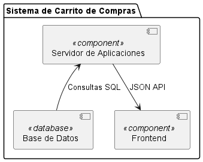

 ## **SISTEMA DE CARRITO DE COMPRAS** ##
 ------------------------------------------
 ### **Integrante** ###
 - Maria Sofia Aljure Herrera
 ------------------------------------------
 ### **Descripción General** ###
 - Para este proyecto, se desarrollara una base de datos para un sistema de carrito de compras que integre
 funcionalidades tanto para administradores como para compradores.
 -----------------------------------------
### **Estructura Base De Datos** ###
 - #### **Diagrama De Componentes** ####
Describe los componentes físicos del sistema, como archivos, bibliotecas,
y sus dependencias.
### **Estructura Base De Datos** ###
1. ### **Sistema de Carrito de Compras** --> Paquete
- Este paquete agrupa todos los componentes principales que forman parte del sistema.
2. ### **Componentes del Diagrama** --> Base de Datos ([Base de Datos] << database >>)
- Representa el almacenamiento, donde se guardan todas las entidades del sistema (Usuarios, Productos, Inventario, Facturas, Detalles de Factura).
- Gestiona las consultas SQL necesarias para crear, leer, actualizar y eliminar datos (CRUD).
3. ### **Servidor de Aplicaciones** --> ([Servidor de Aplicaciones] << component >>)
- Este componente interactúa directamente con la base de datos y procesa la lógica de negocio del sistema.
- Gestiona las peticiones de CRUD a la base de datos y traduce la información a un formato JSON
4. ### **Frontend** --> ([Frontend] << component >>)
- Es la interfaz de usuario del sistema, responsable de la visualización y captura de datos del usuario.
-----------------------------------------------
 DIAGRAMA DE COMPONENTES (FORMATO WSD)
  ```js
  @startuml Diagrama Componentes 

package "Sistema de Carrito de Compras" {
    component [Base de Datos] <<database>>
    component [Servidor de Aplicaciones] <<component>>
    component [Frontend] <<component>>
}

[Base de Datos] -up-> [Servidor de Aplicaciones] : Consultas SQL
[Servidor de Aplicaciones] --> [Frontend] : JSON API

@enduml
   ```
-------------------------------------------
