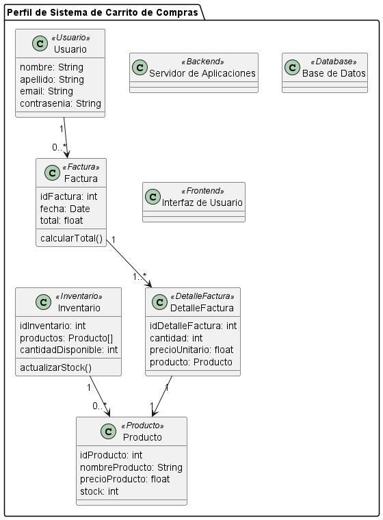

## **SISTEMA DE CARRITO DE COMPRAS** ##
 ------------------------------------------
 ### **Integrante** ###
 - Maria Sofia Aljure Herrera
 ------------------------------------------
 ### **Descripción General** ###
 - Para este proyecto, se desarrollara una base de datos para un sistema de carrito de compras que integre
 funcionalidades tanto para administradores como para compradores.
 -----------------------------------------
### **Diagrama De Paquetes**
Extiende la semántica de UML mediante estereotipos y etiquetas personalizadas. Este diagrama de perfil muestra las clases principales y su estructura en el sistema de carrito de compras. Cada clase está asociada con un estereotipo que representa su rol en el sistema, y las relaciones muestran cómo interactúan entre sí en la gestión de usuarios, productos, inventarios, y facturación.
### **Estructura Base De Datos** ###
- #### **Diagrama De Pefril** ####
**Encapsulamiento en el Paquete --> "Perfil de Sistema de Carrito de Compras"**
- El package "Perfil de Sistema de Carrito de Compras" agrupa todas las clases que conforman el sistema, representando un "perfil" general para el sistema de carrito de compras.
### **Clases Con Estereotipos** 
1. **Usuario << Usuario >>**
- Es la que representa la entidad "Usuario" del sistema.

**Tiene atributos como:**
- nombre, apellido, email, y contrasenia, todos de tipo String.

**R:** Cada Usuario puede tener múltiples Facturas. 

 2. **Producto << Producto >>**
- Es la que representa cada artículo disponible para la compra.

**Tiene atributos como:**
- idProducto: Identificador único del producto.
- nombreProducto, precioProducto, y stock (cantidad disponible).

**R:** Cada Producto puede estar relacionado con múltiples DetalleFactura y Inventario.

3. **Inventario << Inventario >>**
- Es la que controla el inventario de productos.

**Tiene atributos como:**
- idInventario: ID único del inventario.
- productos: Lista de productos en el inventario.
- cantidadDisponible: Cantidad total disponible en inventario.

**Método**
actualizarStock(): Método para actualizar el stock de productos.

**R:** Inventario contiene una lista de Producto.

4. **Factura << Factura >>**
- Es la que representa una transacción o compra realizada por un usuario. 

**Tiene atributos como:**
- idFactura, fecha y total.

**Método**
calcularTotal(): Calcula el valor total de la factura.

**R:** Una Factura tiene múltiples DetalleFactura.

5. **DetalleFactura << DetalleFactura >>**
- Es el detalle de cada producto en una factura.

**Tiene atributos como:**

- idDetalleFactura, cantidad, precioUnitario, y referencia a Producto.

**R:** Cada DetalleFactura está vinculado a un solo Producto.

6. **Servidor de Aplicaciones << Backend >>**

- Es la que representa el servidor de aplicaciones, donde se ejecutan las operaciones del sistema.
- Es el etiquetado con el estereotipo << Backend >> para indicar su rol de soporte en el servidor.

7. **Base de Datos << Database >>**

- Es la que representa el componente de base de datos del sistema, donde se almacenan todos los datos persistentes.
- Es el etiquetado con << Database >> para distinguirlo como la base de datos en el sistema.

8. **Interfaz de Usuario << Frontend >>**

- Es la que representa la interfaz con la que interactúan los usuarios finales.
- Es el etiquetado con << Frontend >> para indicar su rol de presentación y acceso del usuario.
---------------------------------------------------
## **DIAGRAMA DE PERFIL (FORMATO WSD)** ##
```js
@startuml Diagrama De Perfil

package "Perfil de Sistema de Carrito de Compras" {
    
class Usuario <<Usuario>> {
    nombre: String
    apellido: String
    email: String
    contrasenia: String
}
class Producto <<Producto>> {
    idProducto: int
    nombreProducto: String
    precioProducto: float
    stock: int
}

class Inventario <<Inventario>> {
    idInventario: int
    productos: Producto[]
    cantidadDisponible: int
    actualizarStock()
}

class Factura <<Factura>> {
    idFactura: int
    fecha: Date
    total: float
    calcularTotal()
}

class DetalleFactura <<DetalleFactura>> {
    idDetalleFactura: int
    cantidad: int
    precioUnitario: float
    producto: Producto
}

class "Servidor de Aplicaciones" <<Backend>> 
class "Base de Datos" <<Database>> 
class "Interfaz de Usuario" <<Frontend>> 

Usuario "1" --> "0..*" Factura
Factura "1" --> "1..*" DetalleFactura
DetalleFactura "1" --> "1" Producto
Inventario "1" --> "0..*" Producto
}

@enduml
```
------------------------------------------
