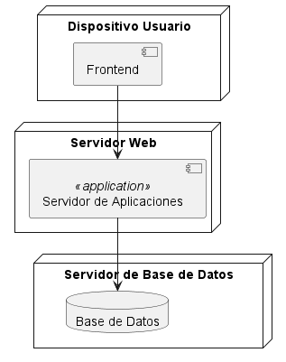

## **SISTEMA DE CARRITO DE COMPRAS** ##
 ------------------------------------------
 ### **Integrante** ###
 - Maria Sofia Aljure Herrera
 ------------------------------------------
 ### **Descripción General** ###
 - Para este proyecto, se desarrollara una base de datos para un sistema de carrito de compras que integre
 funcionalidades tanto para administradores como para compradores.
 -----------------------------------------
### **Diagrama De Despliegue**
modela la distribución física de los nodos (servidores,dispositivos) y artefactos que se ejecutan en ellos, en este caso se organiza el sistema en tres nodos clave (Servidor Web, Dispositivo Usuario, y Servidor de Base de Datos) y se muestra cómo estos componentes interactúan para completar las operaciones del sistema. El Frontend envía solicitudes al Servidor de Aplicaciones y a su vez, consulta o actualiza la Base de Datos para responder a esas solicitudes.
### **Estructura Base De Datos** ###
 - #### **Diagrama De Despliegue** ####
1. ### **Nodos (Nodes)** -->  Servidor Web (node "Servidor Web") ####
- Representa el entorno donde se ejecuta el Servidor de Aplicaciones.
- Dentro de este nodo se define el componente "Servidor de Aplicaciones", que se encarga de gestionar la lógica de negocio y las comunicaciones entre el frontend y la base de datos.
#### **Dispositivo Usuario -->** (node "Dispositivo Usuario")
- Representa el dispositivo del usuario final, como un navegador o aplicación cliente desde donde se interactúa con el sistema.
- También contiene el componente Frontend, la interfaz con la que el usuario interactúa directamente para realizar acciones en el sistema (como visualizar productos o realizar una compra).
#### **Servidor de Base de Datos -->** (node "Servidor de Base de Datos")
- Este nodo representa el entorno donde se encuentra la Base de Datos del sistema.
- Dentro de este nodo está el componente "Base de Datos", que almacena y gestiona la información necesaria, como los usuarios, productos, inventario, y facturas.
2. ### **Componentes (Components)** ###
#### **Servidor de Aplicaciones** --> (component "Servidor de Aplicaciones" << application >>)
- Este componente contiene la lógica de negocio y es el punto central que conecta el Frontend con la Base de Datos.
- También realiza consultas y actualizaciones en la base de datos y proporciona los resultados a la interfaz de usuario en el dispositivo cliente.
#### **Frontend** --> (component "Frontend")
- Es la interfaz visible para el usuario, donde se realizan las interacciones. Se comunica con el Servidor de Aplicaciones para obtener o actualizar datos.
#### **Base de Datos** --> (database "Base de Datos")
- Es el componente que almacena toda la información del sistema, incluidas las entidades Usuario, Producto, Inventario, Factura y Detalle Factura.
----------------------------------------------------------
 ## **DIAGRAMA DE DESPLIEGUE (FORMATO WSD)** ##
  ```js
  @startuml Diagrama De Despliegue 

node "Servidor Web" {
    component "Servidor de Aplicaciones" <<application>>
}

node "Dispositivo Usuario" {
    component "Frontend"
}

node "Servidor de Base de Datos" {
    database "Base de Datos"
}

"Servidor de Aplicaciones" --> "Base de Datos"
"Frontend" --> "Servidor de Aplicaciones"
@enduml

```
------------------------------------------------------------
