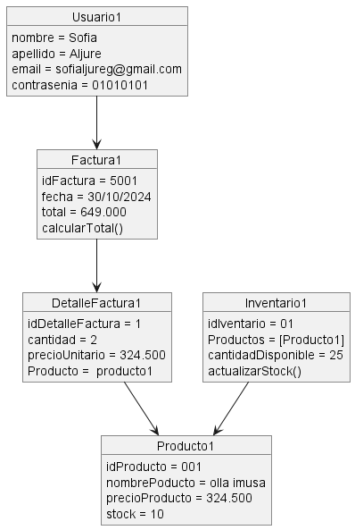

 ## **SISTEMA DE CARRITO DE COMPRAS** ##
 ------------------------------------------
 ### **Integrante** ###
 - Maria Sofia Aljure Herrera
 ------------------------------------------
 ### **Descripción General** ###
 - Para este proyecto, se desarrollara una base de datos para un sistema de carrito de compras que integre
 funcionalidades tanto para administradores como para compradores.
 -----------------------------------------
### **Estructura Base De Datos** ###
 - #### **Diagrama de Objetos** ####
 Este será el que muestre las instancias específicas de las clases en un momento dado.
### **Estructura Base De Datos** ###
#### Entidades Principales ####
1. ### **Usuario**  --> Usuario1
#### **Atributos:** ####
- nombre 
- apellido
- email
- contrasenia

(Este puede tener múltiples facturas relacionadas. Usuario1 se relaciona con Factura1, indicando que "Sofia" ha realizado una compra.)
Producto

2. ### **Producto**  --> Producto1
#### **Atributos:** ####
- idProducto
- nombreProducto
- precioProducto
- stock

(El producto está relacionado tanto con el Inventario como con el DetalleFactura, porque que es parte del inventario y se ve en los detalles de la factura cuando es comprado.)

3. ### **Inventario** --> Inventario1
#### **Atributos:** ####
- idInventario
- Productos
- cantidadDisponible
- actualizarStock()

(Está relacionado con Producto1 y sirve para gestionar las cantidades y disponibilidad de cada producto.)

4. ### **DetalleFactura** --> DetalleFactura1
#### **Atributos:** ####

- idDetalleFactura
- cantidad
- precioUnitario
- Producto

(Se relaciona con Factura y Producto, porque representa los detalles de una transacción individual dentro de la factura.)

5. ### **Factura** -->Factura1
#### **Atributos:** ####

- idFactura
- fecha
- total
- calcularTotal()

(La Factura está asociada al Usuario que realizó la compra y contiene los DetalleFactura que separa los productos y cantidades comprados.)

----------------------------------------
DIAGRAMA DE OBJETO (FORMATO WSD)
  ```js
  @startuml Diagrama Objeto 

object Usuario1 {
    nombre = Sofia
    apellido = Aljure
    email = sofialjureg@gmail.com
    contrasenia = 01010101
}
object Producto1 {
    idProducto = 001
    nombrePoducto = olla imusa
    precioProducto = 324.500
    stock = 10

}
object Inventario1 {
    idIventario = 01
    Productos = [Producto1]
    cantidadDisponible = 25
    actualizarStock()

}
object DetalleFactura1 {
    idDetalleFactura = 1
    cantidad = 2 
    precioUnitario = 324.500
    Producto =  producto1

}
object Factura1 {
    idFactura = 5001
    fecha = 30/10/2024 
    total = 649.000
    calcularTotal()

}
Usuario1 --> Factura1
Factura1 --> DetalleFactura1
DetalleFactura1 --> Producto1
Inventario1 --> Producto1
@enduml
   ```
------------------------------

