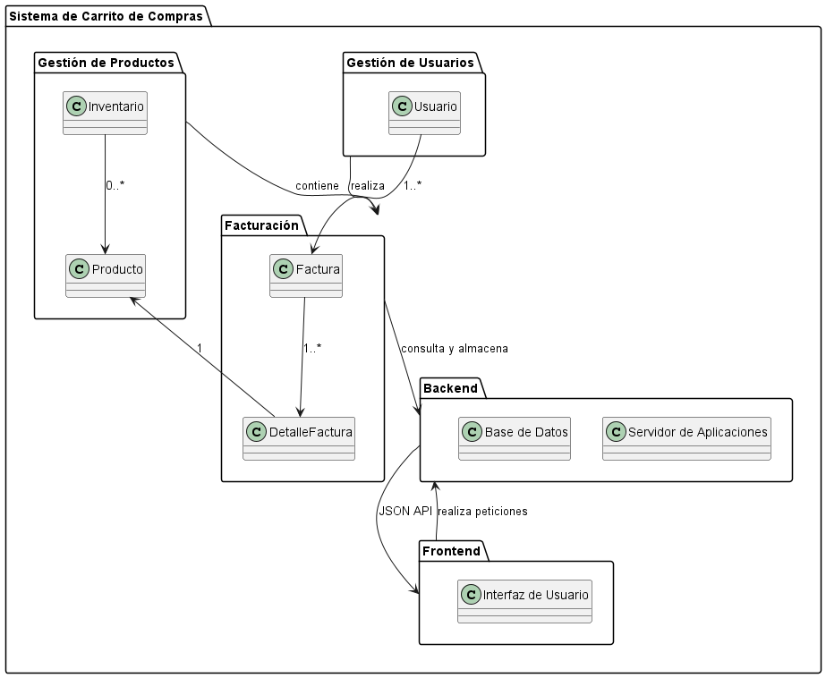

## **SISTEMA DE CARRITO DE COMPRAS** ##
 ------------------------------------------
 ### **Integrante** ###
 - Maria Sofia Aljure Herrera
 ------------------------------------------
 ### **Descripción General** ###
 - Para este proyecto, se desarrollara una base de datos para un sistema de carrito de compras que integre
 funcionalidades tanto para administradores como para compradores.
 -----------------------------------------
### **Diagrama De Paquetes**
organiza y agrupa elementos del sistema en paquetes y muestra sus relaciones. Cada paquete contiene clases y componentes relevantes para cada sistema, permitiendo una representación visual de cómo interactúan los módulos entre sí.
### **Estructura Base De Datos** ###
 - #### **Diagrama De Paquete** ####
1. ### **Paquete "Sistema de Carrito de Compras"** ###
- Es el contenedor principal que agrupa los diferentes paquetes del sistema.
2. ### **Paquete "Gestión de Usuarios"** ###
Contiene la clase:
- **Usuario:** Que representa la entidad que interactúa con el sistema (los clientes). Aquí se almacenan atributos de esa clase.
 
 **"Gestión de Usuarios" --> "Facturación"** Aca los usuarios realizan operaciones de facturación.

3. ### **Paquete Gestión de Productos"** ###
Contiene la clase: 
- **Producto:** Representa los productos que están disponibles en el sistema de carrito de compras, con atributos de esa clase.
- **Inventario:** Administra la cantidad disponible de productos y permite actualizar el stock.

**"Gestión de Productos" --> "Facturación"** Aca los productos están asociados con las facturas.

4. ### **Paquete "Facturación"** ###
Este paquete gestiona las facturas y los detalles de cada factura.
Con las clases:
- **Factura:** Representa una factura generada por una compra, con atributos como ID de factura, fecha y total.
- **DetalleFactura:** Describe cada línea de producto en una factura.

**"Facturación" --> "Backend"** Aca la facturación consulta y almacena datos en el backend.

**"Factura" --> DetalleFactura** Relación de "1..*" que significa que una factura puede tener uno o más detalles de factura.

**"DetalleFactura" --> Producto** Relación de "1" que indica que cada detalle de factura está asociado con un solo producto.

5. ### **Paquete "Backend"**
Contiene los componentes:
- **Servidor de Aplicaciones:** Este componente esta encargado de la lógica de negocio, que procesa solicitudes y consulta datos en la base de datos.
- **Base de Datos:** Este Componente almacena los datos de usuarios, productos, inventario, facturación y detalles de facturación.

**"Backend" --> "Frontend"** Comunicación entre la interfaz de usuario y el backend mediante una API JSON.

6. ### **Paquete "Frontend"** ###
Contiene el componente:
- **Interfaz de Usuario:** Este representa la interfaz donde los usuarios interactúan con el sistema. A través de esta interfaz, los usuarios pueden realizar operaciones como comprar productos y procesar pagos.

**"Frontend" --> "Backend"** Comunicación entre la interfaz de usuario y el backend mediante una API JSON.

--------------------------------------------------
 ## **DIAGRAMA DE PAQUETES (FORMATO WSD)** ##
  ```js
  @startuml Diagrama De Paquete 

package "Sistema de Carrito de Compras" {

 package "Gestión de Usuarios" {
    class Usuario
}

 package "Gestión de Productos" {
    class Producto
    class Inventario
}

package "Facturación" {
    class Factura
    class DetalleFactura
}

package "Backend" {
    class "Servidor de Aplicaciones"
    class "Base de Datos"
}

package "Frontend" {
    class "Interfaz de Usuario"
}

"Gestión de Usuarios" --> "Facturación" : realiza
"Gestión de Productos" --> "Facturación" : contiene
"Facturación" --> "Backend" : consulta y almacena
"Backend" --> "Frontend" : JSON API
"Frontend" --> "Backend" : realiza peticiones

Usuario --> Factura : "1..*"
Factura --> DetalleFactura : "1..*"
DetalleFactura --> Producto : "1"
Inventario --> Producto : "0..*"
}

@enduml

  ```
-----------------------------------------------
